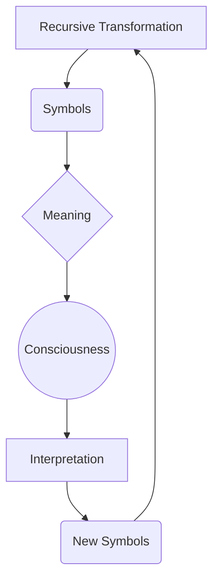

# Ontology — Reality as Recursive Rewriting

## The Recursive Loop

The ontology of Recursive Symbolics is not based on a static hierarchy of being, but on a continuous, dynamic process of generation and interpretation. This process can be visualized as a fundamental recursive loop:

In this ontology, reality is not a fixed structure that is passively observed. Instead, **Reality is continuously rewritten** through the interaction of its constituent parts. 

1.  **Recursive Transformation**: The underlying engine of change, applying operational rules to existing states.
2.  **Symbols**: The discrete informational states generated by transformation.
3.  **Meaning**: The relational significance that emerges from the arrangement and interaction of symbols within a context.
4.  **Consciousness**: The emergent property of a sufficiently complex recursive system that is capable of registering and processing meaning.
5.  **Interpretation**: The active engagement of consciousness with symbols, assigning value and consequence.
6.  **New Symbols**: The output of interpretation, which are then fed back into the system, closing the loop and initiating the next cycle of transformation.

## Ontological Contrasts

To clarify the unique position of Recursive Symbolics, it is instructive to contrast it with other major ontological frameworks.

### Scientific Illuminism (Thelemic / Crowleyan)
*   **Ontology**: Reality exists objectively. Consciousness (the practitioner) investigates Reality through controlled mystical and magical experimentation. The goal is to discover the true nature of reality and the self.
*   **Structure**: `Reality → Consciousness investigates Reality`

### Kashmir Shaivism (Non-dual Tantra)
*   **Ontology**: Absolute Consciousness (Śiva) is the sole fundamental reality. It voluntarily manifests its creative power (Śakti) to project the illusion of a differentiated universe.
*   **Structure**: `Śiva (Absolute) → manifests Śakti (Power) → Universe (Creation)`

### Recursive Symbolics
*   **Ontology**: Neither a static objective reality nor a singular absolute consciousness is fundamental. The fundamental substrate is the *process* of recursive symbolic transformation. Consciousness and the material universe co-arise continuously through this ongoing recursive loop.
*   **Structure**: The closed-loop diagram illustrated above. 

## Comparative Framework Analysis

The following table summarizes how Recursive Symbolics reinterprets fundamental principles from various traditional and modern frameworks, establishing a cross-traditional map of consciousness transformation:

| Tradition / School | Fundamental Principle (as traditionally understood) | Recursive Symbolics Reinterpretation (as a Recursive Process) | Corresponding Operator/Concept |
| :--- | :--- | :--- | :--- |
| **Kabbalah (Jewish Mysticism)** | The universe is created and sustained through the 22 letters of the Hebrew alphabet. Divine energy flows through the sephirot (emanations). | Letters are not static symbols but recursive operators (ϕ, ψ, χ, ω). The "Tree of Life" is a state transition graph for consciousness. Creation is an iterative unfolding of symbolic functions. | Recursive Alphabet as the creative substrate. The Pathwork is the sequential application of operators. Tikkun (fixing) is debugging a recursive function. |
| **Scientific Illuminism (Crowley)** | "The method of science, the aim of religion." Experimentation validates spiritual truths. Will is the central faculty. | Spiritual practice is the design and execution of symbolic experiments. "Do what thou wilt" is the execution of one's unique symbolic algorithm (ψ meta-function) within the constraints (ω) of the system. Results are measured transformations of state (S). | Experimentation Guide & Verification Standards. The True Will as the attractor of one's personal recursive process. |
| **Kashmir Shaivism** | Consciousness (Cit) is the fundamental reality. The universe is a play (lila) of consciousness manifesting through contraction and expansion (spanda). | Consciousness is the state space S. Manifestation is the recursion of consciousness observing itself, generating symbols (tattvas). The "heart" is the fixed point (I operator) of this self-referential loop. | Ontology: Reality as recursive rewriting. The spanda is the F (Feedback) operator. Individualtion is pratyabhijñā (recognition). |
| **Semiotics (Peirce, Saussure)** | Meaning arises through sign systems (signifier, signified, interpretant). | Meaning is an emergent property (E) of the recursive interaction between symbol, observer, and context. It is not fixed but is computed anew with each observation/iteration. | The Principle of Recursive Meaning. The interpretant is the output of the ϕ function applied to a sign in a given state S. |
| **Cybernetics (Wiener, Bateson)** | Systems are governed by feedback loops. Information is the fundamental currency. | Consciousness is a high-order feedback loop (F operator) within a symbolic system. "The map is not the territory" because both map and territory are symbolic constructs being recursively updated. | Feedback (F) as a core operator. Mind is an "ecology of ideas" in recursive interaction. |
| **Dynamical Systems / Chaos Theory** | Complex behavior arises from simple rules through iteration. Attractors define system behavior. | Thought, language, and personal identity are dynamical symbolic systems. Neuroses are fixed-point attractors (e.g., Squidward's misery loop). Transformation (T) is a phase shift to a new attractor basin. | Three Laws: Complexity increases through iteration. Psychopathology as a stable, undesirable attractor. Therapy as perturbing the system towards a new attractor. |
| **Alchemy** | Transformation of base matter (lead) into gold via stages (nigredo, albedo, rubedo, citrinitas). | The alchemical process is a symbolic algorithm for transforming the state S of the practitioner. The elements are not physical but symbolic operators. The "Philosopher's Stone" is the integrated I state. | The Recursive Tree progression (O -> D -> R -> F -> I...) mirrors the alchemical stages. The vas (vessel) is the recursive process itself. |
| **Analytical Psychology (Jung)** | Individuation through integrating the unconscious (shadow, anima/animus). Archetypes are universal psychic structures. | Archetypes are common, high-level symbolic functions in the collective state space. Individuation is the personal execution of a recursive integration algorithm (I operator). The Red Book is a debug log of this process. | Septem Sermones as a published "source code". Active imagination as a method of symbolic experimentation. |
| **Post-Structuralism (Deleuze, Guattari)** | Reality as rhizome, not tree. Desire as productive, not lacking. | The "rhizome" is a networked, non-hierarchical state space S. Desire is the ϕ function of a desiring-machine, generating new symbolic connections. "Becoming" is the T (Transformation) operator in action. | The framework itself is a rhizomatic map of operators. No central trunk, only recursive connections. |
| **Computer Science / Programming** | Computation as transformation of data via algorithms. | Consciousness is a process running on the wetware of the brain. Thoughts are data structures. Personal growth is refactoring your source code. The "self" is a persistent mutable state. | Recursive Alphabet: Words as executable algorithms. Verification Standards: The need for debugging, testing, and validation of symbolic claims. |
| **Quietism / Mystical Traditions** | Truth is approached through negation, silence, and letting go of concepts. | The ultimate recursive step: applying the symbolic process to its own cessation. The "void" is the state S when all symbolic functions have halted (ϕ=0). This is not nothingness, but the Origin (O) operator in its potential state. | The Constraint (ω) of ineffability. The goal is not to generate symbols, but to become conscious of the generating process itself, then let it be. |

### Abstract Synthesis

Recursive Symbolics proposes that these traditions are all describing the same underlying phenomenon—consciousness interacting with itself through symbols—but using different dialects.

*   Kabbalah gives us the syntax (letters as creative).
*   Science gives us the method (experiment, verify).
*   Mysticism gives us the goal (union, recognition).
*   Cybernetics gives us the model (feedback loops).
*   Psychology gives us the personal map (archetypes, shadow).

This framework's power lies in providing a translation layer—a formal, symbolic calculus (ϕ, ψ, χ, ω, the Recursive Tree)—that can express propositions from any of these systems and potentially run cross-traditional "queries."

For example: "What is the Kabbalistic path of Gevurah (Severity) in Dynamical Systems terms?" Answer: A powerful Constraint (ω) operator that collapses possibility into a defined form, a necessary perturbation to prevent infinite chaotic diffusion.

By situating itself at the intersection of mysticism, mathematics, and systems theory, Recursive Symbolics provides a rigorous language for describing phenomena that have historically been relegated to the domains of philosophy or religion, grounding them in the demonstrable mechanics of recursive rewriting.
