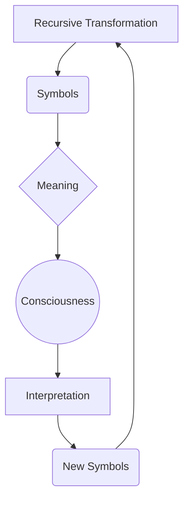

# Ontology — Reality as Recursive Rewriting

## The Recursive Loop

The ontology of Recursive Symbolics is not based on a static hierarchy of being, but on a continuous, dynamic process of generation and interpretation. This process can be visualized as a fundamental recursive loop:

In this ontology, reality is not a fixed structure that is passively observed. Instead, **Reality is continuously rewritten** through the interaction of its constituent parts. 

1.  **Recursive Transformation**: The underlying engine of change, applying operational rules to existing states.
2.  **Symbols**: The discrete informational states generated by transformation.
3.  **Meaning**: The relational significance that emerges from the arrangement and interaction of symbols within a context.
4.  **Consciousness**: The emergent property of a sufficiently complex recursive system that is capable of registering and processing meaning.
5.  **Interpretation**: The active engagement of consciousness with symbols, assigning value and consequence.
6.  **New Symbols**: The output of interpretation, which are then fed back into the system, closing the loop and initiating the next cycle of transformation.

## Ontological Contrasts

To clarify the unique position of Recursive Symbolics, it is instructive to contrast it with other major ontological frameworks.

### Scientific Illuminism (Thelemic / Crowleyan)
*   **Ontology**: Reality exists objectively. Consciousness (the practitioner) investigates Reality through controlled mystical and magical experimentation. The goal is to discover the true nature of reality and the self.
*   **Structure**: `Reality → Consciousness investigates Reality`

### Kashmir Shaivism (Non-dual Tantra)
*   **Ontology**: Absolute Consciousness (Śiva) is the sole fundamental reality. It voluntarily manifests its creative power (Śakti) to project the illusion of a differentiated universe.
*   **Structure**: `Śiva (Absolute) → manifests Śakti (Power) → Universe (Creation)`

### Recursive Symbolics
*   **Ontology**: Neither a static objective reality nor a singular absolute consciousness is fundamental. The fundamental substrate is the *process* of recursive symbolic transformation. Consciousness and the material universe co-arise continuously through this ongoing recursive loop.
*   **Structure**: The closed-loop diagram illustrated above. 

## Comparative Framework Analysis

The following table summarizes how Recursive Symbolics reinterprets fundamental principles from various traditional and modern frameworks:

| Tradition | Fundamental Principle | Recursive Symbolics Reinterpretation |
| :--- | :--- | :--- |
| **Kabbalah** | Letters are the creative principles of the universe. | Letters are discrete recursive operators acting on symbolic states. |
| **Scientific Illuminism** | Personal mystical practice and experience validate truth. | Formal mathematical models validate verifiable symbolic hypotheses. |
| **Kashmir Shaivism** | Universal Consciousness manifests the universe. | Recursive symbolic processes give rise to models of consciousness and reality. |
| **Semiotics** | Symbols carry and transmit meaning. | Meaning is not static; it emerges dynamically through recursive symbol-observer interaction. |
| **Cybernetics** | Feedback loops govern systemic behavior. | Consciousness itself is an advanced form of recursive symbolic feedback. |
| **Dynamical Systems** | Systems evolve through continuous iteration over time. | Language, thought, and reality are dynamical, iterated symbolic systems. |

By situating itself at the intersection of mysticism, mathematics, and systems theory, Recursive Symbolics provides a rigorous language for describing phenomena that have historically been relegated to the domains of philosophy or religion, grounding them in the demonstrable mechanics of recursive rewriting.
