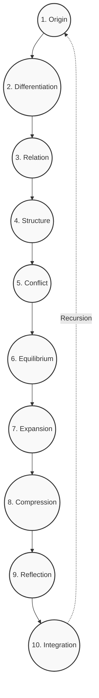

# The Recursive Tree

## Axiomatic Foundation
The Recursive Tree outlines the macro-structure of recursive transformations. While the Recursive Alphabet provides the discrete functional operators (the micro-code), the Recursive Tree represents the sequential, overarching architecture of emergent complexity. It describes how an initial unformed state cascades through a structured hierarchy to achieve complete systemic integration.

"Every recursive system tends toward increasing symbolic complexity."

## The 10 Recursive Operators

The Tree is composed of ten sequential operators. Each operator processes the output of the previous stage, adding complexity, depth, and relational structure.

### 1. Origin ($O_1$)
* **Transformation**: The emergence of the initial seed from the void. The absolute beginning.
* **Input/Output**: Transforms Nothingness into a Singularity.
* **Examples**:
  * *Mathematical*: The number 1; the point.
  * *Linguistic*: The root phoneme.
  * *Psychological*: The initial spark of unstructured awareness.
  * *Natural*: The Big Bang singularity.

### 2. Differentiation ($O_2$)
* **Transformation**: The division of the singularity into binary oppositions. The establishment of contrast.
* **Input/Output**: Transforms Singularity ($O_1$) into Duality.
* **Examples**:
  * *Mathematical*: Positive/Negative; the line.
  * *Linguistic*: Consonant vs. Vowel.
  * *Psychological*: Subject/Object division.
  * *Natural*: Particle/Antiparticle pairs.

### 3. Relation ($O_3$)
* **Transformation**: The creation of a dynamic connection between the differentiated poles.
* **Input/Output**: Transforms Duality ($O_2$) into a relational triad (Thesis, Antithesis, Synthesis).
* **Examples**:
  * *Mathematical*: The triangle; sine wave oscillation.
  * *Linguistic*: Subject-Verb-Object syntax.
  * *Psychological*: The act of perception linking perceiver and perceived.
  * *Natural*: Electromagnetic fields.

### 4. Structure ($O_4$)
* **Transformation**: The stabilization of dynamic relations into fixed, predictable patterns.
* **Input/Output**: Transforms dynamic Triads ($O_3$) into stable, systemic frameworks.
* **Examples**:
  * *Mathematical*: The square; crystalline lattices.
  * *Linguistic*: Grammatical rules; rigid definitions.
  * *Psychological*: Habituation; belief systems.
  * *Natural*: Solid matter; molecular bonds.

### 5. Conflict ($O_5$)
* **Transformation**: The introduction of entropy, friction, and stress to test the stability of the structure.
* **Input/Output**: Transforms stable Structure ($O_4$) into a state of flux and breakdown.
* **Examples**:
  * *Mathematical*: Asymmetry; chaotic attractors.
  * *Linguistic*: Paradox; contradiction.
  * *Psychological*: Cognitive dissonance; trauma.
  * *Natural*: Thermodynamics; erosion.

### 6. Equilibrium ($O_6$)
* **Transformation**: The resolution of conflict through a higher-order balancing mechanism.
* **Input/Output**: Transforms Conflict ($O_5$) into a resilient, dynamic balance.
* **Examples**:
  * *Mathematical*: The hexagon; golden ratio.
  * *Linguistic*: Poetic metaphor; resolution of paradox.
  * *Psychological*: Acceptance; emotional regulation.
  * *Natural*: Homeostasis; ecological balance.

### 7. Expansion ($O_7$)
* **Transformation**: The outward projection and scaling of the balanced system.
* **Input/Output**: Transforms Equilibrium ($O_6$) into networked proliferation.
* **Examples**:
  * *Mathematical*: Exponential growth; fractals.
  * *Linguistic*: The proliferation of vocabulary; storytelling.
  * *Psychological*: Extroversion; exploration.
  * *Natural*: Evolutionary radiation; galactic expansion.

### 8. Compression ($O_8$)
* **Transformation**: The gathering of expanded complexity back into dense, efficient representations.
* **Input/Output**: Transforms Expansion ($O_7$) into high-density information packets.
* **Examples**:
  * *Mathematical*: Algorithmic compression; limits.
  * *Linguistic*: Symbols; archetypes.
  * *Psychological*: Intuition; memory consolidation.
  * *Natural*: Black holes; DNA encoding.

### 9. Reflection ($O_9$)
* **Transformation**: The system turns its awareness upon itself, analyzing its own history and states.
* **Input/Output**: Transforms Compressed data ($O_8$) into self-awareness and meta-cognition.
* **Examples**:
  * *Mathematical*: Recursive functions; self-referential sets.
  * *Linguistic*: Meta-language; self-inquiry.
  * *Psychological*: Introspection; lucid dreaming.
  * *Natural*: The mirror test in animals; nervous system feedback.

### 10. Integration ($O_{10}$)
* **Transformation**: The final collapse of the entire tree back into a unified, transformed whole. The end state which becomes the seed ($O_1$) for the next octave.
* **Input/Output**: Transforms Reflection ($O_9$) into the Holon (Whole/Part).
* **Examples**:
  * *Mathematical*: The limit as $n \to \infty$; the torus.
  * *Linguistic*: The unspoken word; complete semantic resonance.
  * *Psychological*: Self-actualization; non-dual awareness.
  * *Natural*: Complete ecosystem symbiosis.

## Structural Parallels

The Recursive Tree maps structurally to various ancient models of emanation. Below is a structural mapping to the Kabbalistic Tree of Life (Sephiroth). Note that this is a topological parallel emphasizing recursive logic, independent of theological claims.

| Recursive Operator | Kabbalistic Sephirah | Functional Mapping |
| :--- | :--- | :--- |
| 1. Origin | Keter (Crown) | The initial spark / Unmanifest potential |
| 2. Differentiation | Chokhmah (Wisdom) | The raw active principle / Divergence |
| 3. Relation | Binah (Understanding) | The structuring, receptive principle |
| 4. Structure | Chesed (Mercy/Greatness) | Expansion of form / Stable foundation |
| 5. Conflict | Gevurah (Severity/Strength) | Constraint, friction, and judgment |
| 6. Equilibrium | Tiferet (Beauty/Harmony) | The balance of expansion and constraint |
| 7. Expansion | Netzach (Victory/Eternity) | Enduring, outgoing energy |
| 8. Compression | Hod (Splendor) | Formatted, compressed intellect |
| 9. Reflection | Yesod (Foundation) | The filter and feedback loop of reality |
| 10. Integration | Malkuth (Kingdom) | The manifest reality / The final vessel |

## Visual Architecture

*The recursive flow naturally cascades from 1 to 10. Upon reaching Integration, the output is fed back as the Origin for a higher-order recursive sequence.*
