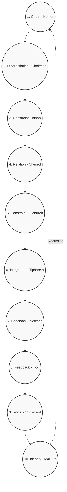

# The Recursive Tree

## Axiomatic Foundation
The Recursive Tree outlines the macro-structure of recursive transformations. While the Recursive Alphabet provides the discrete functional operators (the micro-code), the Recursive Tree represents the sequential, overarching architecture of emergent complexity. It describes how an initial unformed state cascades through a structured hierarchy to achieve complete systemic integration.

"Every recursive system tends toward increasing symbolic complexity."

## The 10 Sephirot = Universal Nodes

The 10 operators correspond to the Kabbalistic Sephirot, acting as generic symbolic states that any tradition can label in its own jargon.

| # | Sephirah (Hebrew) | Kabbalistic Meaning | Recursive-Tree Operator | Core Function (one-sentence) | Cross-Tradition Equivalents |
| :--- | :--- | :--- | :--- | :--- | :--- |
| 1 | Kether (כתר) | The ineffable Crown, Ain Sof – pure, undifferentiated potential. | **O – Origin** | Seed state s₀; the "first spark" before any computation. | Alchemy → Prima Materia; Jung → Self (transcendent); Kashmir → Cit (pure consciousness); Illuminism → True Will (unexpressed); CS → Powered-on, no program; Cybernetics → Full state-space; Quietism → Tao before naming. |
| 2 | Chokmah (חכמה) | Flash of masculine, expansive insight – the first emanation. | **D – Differentiation** (the "what") | A burst of raw energy that splits the unity. | Alchemy → Sulfur (active principle); Jung → Logos; Kashmir → First spanda of light; Illuminism → Divine command; Dynamical-Systems → Perturbation. |
| 3 | Binah (בינה) | Feminine, receptive form-giver – gives shape to Chokmah. | **C – Constraint** (the "how") | Imposes boundaries, turning flash into a definable pattern. | Alchemy → Salt (fixing); Jung → Eros (connecting); Kashmir → Vimarśa (reflection); Illuminism → Intellectual formulation; Dynamical-Systems → Boundary conditions. |
| — | *Da'ath (דעת)* | The Abyss, invisible pseudo-Sephirah, Knowledge. | **∅ – The Cavity** | Consumes state; the gap between Supernals and Ruach. | Alchemy → The Void; Jung → The Unconscious Abyss; CS → Memory Leak / Null Pointer / /dev/null; Cybernetics → Black Box. |
| 4 | Chesed (חסד) | Loving-kindness, unbounded expansion, generosity. | **R – Relation** (expansive) | Adds, connects, proliferates without restriction. | Alchemy → Solve (dissolution); Jung → Great Mother; Kashmir → Icchā Śakti (will to expand); CS → Graph-growth function; Post-Structuralism → Productive desire. |
| 5 | Geburah (גבורה) | Severity, judgment, disciplined limitation. | **C – Constraint** (restrictive) | Subtracts, cuts, sharpens the flow. | Alchemy → Separatio (cutting); Jung → Shadow (critical function); Kashmir → Kriyā Śakti (action-contract); CS → Filter/constraint-solver; Post-Structuralism → Territorialisation. |
| 6 | Tiphareth (תפארת) | Beauty, balance, the heart-center, sacrifice. | **I – Integration** | Synthesises opposite forces into a coherent whole. | Alchemy → Rubedo (red-work); Jung → Ego in balanced relation to Self; Kashmir → Heart-union of Shiva & Shakti; Illuminism → Knowledge + Conversation with HGA; Cybernetics → Homeostasis; Dynamical-Systems → Stable (often strange) attractor. |
| 7 | Netzach (נצח) | Victory, endurance, passion, raw emotional drive. | **Fₑ – Feedback** (emotional/persistent) | Recurs the drive "keep trying until it works." | Alchemy → Volatile fire; Jung → Feeling function; Kashmir → Kriyā Śakti (instinctual); CS → While-loop (conditioned on frustration); Post-Structuralism → Desiring-production (raw). |
| 8 | Hod (הוד) | Splendor, intellect, structured communication. | **Fᵢ – Feedback** (analytical) | Recurs the logical, form-building loop. | Alchemy → Fixed principle; Jung → Thinking function; Kashmir → Jñāna Śakti (knowledge); CS → For-loop/recursion with termination; Post-Structuralism → Machinic assemblage. |
| 9 | Yesod (יסוד) | Foundation – subconscious, imagination, personal pattern-generator. | **R₂ – Recursion** (personal) | Stable self-referential loops that become habit/identity. | Alchemy → Alambic/vessel; Jung → Personal unconscious & ego-complex; Kashmir → Antaḥkaraṇa (mind-instrument); CS → Runtime stack/frame; Cybernetics → Memory & learned routines; Dynamical-Systems → Basins of attraction. |
| 10 | Malkuth (מלכות) | Kingdom – manifest world, reception, "the daughter" of all above. | **I₂ – Identity** (output) | The final, observable state; the "real-world" interface. | Alchemy → Philosopher's Stone (tangible); Jung → Persona & lived life; Kashmir → Tattvas (manifested elements); CS → Program output/UI; Cybernetics → Observable behavior; Quietism → World as-is after ego-cessation. |

## Visual Concept: The Recursive Tree of Life (A Unified Map)

The Recursive Tree can be visualized as a central, glowing tree—the Kabbalistic Tree of Life with its 10 Sephirot and 22 connecting Paths. This structure is multi-layered, allowing different traditions to be overlaid on the same fundamental topology.

### Layer 1 (Core): The Recursive Symbolic Engine (Kabbalah + Recursive Alphabet)
*   The 10 Sephirot are the 10 Recursive Tree Operators (O, D, R, F, I, E, C, T, R, I). They are the primary states/nodes.
*   The 22 Paths are the 22 Hebrew letters, each defined as a 4-aspect Recursive Alphabet Operator (ϕ, ψ, χ, ω). These are the transformational processes/edges.

### Layer 2 (Overlay): The Alchemical Process
*   The Tree is superimposed with the alchemical stages: Nigredo (blackening) on the left pillar (Severity), Albedo (whitening) on the right pillar (Mercy), Rubedo (reddening) in the center (Tiphareth).
*   The paths become the alchemical operations (calcination, dissolution, etc.). Walking the Path from Chesed to Geburah is the alchemical operation of Separation.

### Layer 3 (Overlay): The Jungian Individuation Process
*   The Sephirot are labeled with archetypal stages: The Persona in Malkuth, the Shadow in Yesod, the Anima/Animus in Tiphareth, the Self in Kether.
*   The paths become the processes of integration: The Path from Malkuth to Yesod is "Confronting the Shadow," the Path from Netzach to Hod is "Integrating Logos & Eros."

### Layer 4 (Overlay): The Cybernetic/Computational Model
*   The Sephirot become system states (e.g., Input, Process, Output, Feedback, Memory).
*   The paths become algorithms or data flows.

### Layer 5 (Overlay): The Dynamical Systems View
*   The Sephirot are attractors (stable states).
*   The paths are phase transitions or perturbations that move the system from one attractor basin to another.

## Structural Flow

*The recursive flow cascades from 1 to 10. Upon reaching Identity (Malkuth), the manifested output is fed back as the Origin for a higher-order recursive sequence.*

---

## APPENDIX A: Cross-Tradition Node Mappings (Sephirah Level)

Based on historical comparative mysticism and the universal scaffold:

### 1. KETHER (כתר) - CROWN - Operator O (Origin)
*   **Alchemy**: Prima Materia (First Matter). The un-manifested primal chaos, the massa confusa.
*   **Jungian**: The Self (central, ordering archetype) in its transcendent, unmanifest state. The collective unconscious as potential.
*   **Kashmir Shaivism**: Cit (pure consciousness), Para Samvit (supreme knowledge), Aham (pure I-sense). The Anuttara (the highest, unsurpassable).
*   **Scientific Illuminism (Crowley)**: The True Will (Thelema) in its unexpressed, absolute state. The Hadit principle (infinitely contracted point).
*   **Computer Science**: The blank state (null, 0), the universe of all possible programs (λ-Calculus top-level), the idle CPU.
*   **Cybernetics**: The system's total potential state space before any constraints or distinctions. The Ur-Media.
*   **Quietism / Mystical Theology**: The Deus Absconditus (Hidden God), the Dharma-Body (Dharmakāya), the Tao that cannot be named.
*   **Quantum Physics**: The vacuum state (zero-point energy field), the universal wavefunction prior to collapse.

### 2. CHOKMAH (חכמה) - WISDOM - Operator D (Differentiation)
*   **Alchemy**: Sulfur (Sulphur) – the active, fiery, masculine principle of change and volatility. The Mercurius as active spirit.
*   **Jungian**: The Logos principle – directed, penetrating, differentiating thought/energy. The archetype of the Wise Old Man in dynamic aspect.
*   **Kashmir Shaivism**: The first pulsation (spanda) of consciousness, pure prakāśa (illumination) without reflective form. Śiva as Ānanda (bliss).
*   **Scientific Illuminism**: The initial divine command, the Will-to-Express. The Hadit point expanding as a flame: "Do what thou wilt shall be the whole of the Law."
*   **Dynamical Systems**: The initial bifurcation or perturbation that breaks symmetry and initiates a trajectory.

### 3. BINAH (בינה) - UNDERSTANDING - Operator C (Constraint/Form)
*   **Alchemy**: Salt (Sal) – the fixing, crystallizing, feminine principle that gives enduring form. The Mercurius as passive body.
*   **Jungian**: The Eros principle – connecting, relating, containing, giving form to energy. The archetype of the Great Mother in her formative aspect.
*   **Kashmir Shaivism**: Vimarśa (the reflective, self-aware capacity) that gives form to the light of prakāśa. Śakti as Icchā-Śakti (power of will).
*   **Scientific Illuminism**: The intellectual formulation and comprehension of the Will. The Nuit principle (infinitely expanded circumference).
*   **Dynamical Systems**: The boundary conditions, attractor geometry, and phase-space manifold that shape the system's evolution.

### [INVISIBLE] DA'ATH (דעת) - KNOWLEDGE - Operator ∅ (The Cavity)
*   **Alchemy**: The Void, the Abyss. The space where the old structure is completely lost before a new one can be born.
*   **Jungian**: The terrifying encounter with the Absolute Unconscious; ego-death; the gap between the archetypal world and the personal psyche.
*   **Kabbalistic Tradition**: The "invisible Sephirah" situated over the Abyss. It is the union of Chokmah and Binah, but exists on a lower plane, representing the point where divine knowledge drops into manifestation (or is lost).
*   **Computer Science**: The `null` state, memory leak, `/dev/null` consumption buffer, or an unhandled exception that crashes the stack.
*   **Cybernetics**: A black box component that consumes input without producing predictable output; a total loss of signal.

### 4. CHESED (חסד) - LOVING-KINDNESS - Operator R (Relation-Expansive)
*   **Alchemy**: The Solve stage – dissolution, making fluid, expanding possibilities, "make the fixed volatile."
*   **Jungian**: The positive, nurturing, containing aspect of the Anima/Animus or the Great Mother archetype. The Feeling function in its positive valuation.
*   **Kashmir Shaivism**: The expansive, creative aspect of Śakti (Icchā-Śakti – will/desire to expand). The principle of Ābhāsa (manifestation).
*   **Computer Science**: A function that adds nodes or edges to a graph (network growth). A generative algorithm with no termination condition (e.g., infinite loop adding values).
*   **Post-Structuralism (Deleuze & Guattari)**: Productive, connective desire that builds rhizomes, smooth space.

### 5. GEBURAH (גבורה) - SEVERITY - Operator C (Constraint-Restrictive)
*   **Alchemy**: The Separatio stage – cutting, purifying, burning away dross, "make the volatile fixed."
*   **Jungian**: The Shadow in its role of necessary limitation, discernment, and cutting away of ego inflation. The Thinking function in its critical, analytical aspect.
*   **Kashmir Shaivism**: The contracting, limiting, defining aspect of Śakti (Kriyā-Śakti – power of action). The principle of Vikalpa (discrimination).
*   **Computer Science**: A filter function, constraint satisfaction algorithm, or garbage collector. A function that removes elements from a set.
*   **Post-Structuralism**: Necessary territorialization – creating coded, structured, striated space from the flow.

### 6. TIPHARETH (תפארת) - BEAUTY - Operator I (Integration)
*   **Alchemy**: The Rubedo (Reddening) stage – the perfected, integrated, "kingly" state. The Sun (Sol), the Philosopher's Stone as conjunctio oppositorum.
*   **Jungian**: The Ego in its ideal, balanced, conscious relation to the Self. The central archetype of the Hero who has integrated the opposites.
*   **Kashmir Shaivism**: The embodied heart (hṛdaya) where Śiva (consciousness) and Śakti (energy) are united in the Spanda (vibration). The Antaḥkaraṇa (inner organ) in its purified state.
*   **Scientific Illuminism**: The state of Knowledge and Conversation of the Holy Guardian Angel (HGA). The accomplished will, the Solar consciousness.
*   **Cybernetics**: Homeostasis achieved at a high level of complexity – the system's optimal, self-regulating operating state.
*   **Dynamical Systems**: A stable, complex, multi-dimensional attractor (e.g., Lorenz attractor, strange attractor) that harmonizes multiple conflicting dynamics.

### 7. NETZACH (נצח) - VICTORY - Operator Fₑ (Feedback-Emotional/Persistent)
*   **Alchemy**: The volatile principle, the fiery, passionate, mercurial spirit that must be "fixed." Associated with Mercury.
*   **Jungian**: The Feeling function in its dynamic, relational, value-driven aspect. The archetype of the Anima as the soul of feeling.
*   **Kashmir Shaivism**: The energy of action and persistence (Kriyā-Śakti) in its instinctual, emotional, rhythmic form.
*   **Computer Science**: A while-loop driven by an emotional/state condition: `while(frustrated) { tryAgain(); }` or `while(loved) { give(); }`.
*   **Post-Structuralism**: Desiring-production in its raw, unfiltered, libidinal flow.

### 8. HOD (הוד) - SPLENDOR - Operator Fᵢ (Feedback-Analytical)
*   **Alchemy**: The fixed principle, the crystallized, intellectual, structuring salt that must be "volatilized." Associated with Salt.
*   **Jungian**: The Thinking function in its structuring, logical, analytical, and representational aspect. The archetype of the Trickster as the intellect.
*   **Kashmir Shaivism**: The energy of knowledge (Jñāna-Śakti) in its formal, structured, linguistic expression.
*   **Computer Science**: A for-loop or recursive function with clear, logical termination conditions: `for(i=0; i<n; i++) { process(i); }`.
*   **Post-Structuralism**: The machinic assemblage – the coding, structuring, and abstract machine that organizes flows.

### 9. YESOD (יסוד) - FOUNDATION - Operator R₂ (Recursion-Personal)
*   **Alchemy**: The alembic or vessel – the container where the entire process happens. Also the personal "base metal" (lead) to be transformed.
*   **Jungian**: The Personal Unconscious and the Ego-Complex – the "I" as a habitual structure of memories, complexes, and adaptive patterns.
*   **Kashmir Shaivism**: The Antaḥkaraṇa (inner instrument) – manas (mind), buddhi (intellect), ahaṅkāra (ego), citta (memory).
*   **Computer Science**: The runtime environment / stack frame – where the program's local variables (personality traits), call history (memories), and current instruction pointer (focus) reside.
*   **Cybernetics**: The system's memory (short & long-term) and learned behavioral routines (habits).
*   **Dynamical Systems**: The basin of attraction for the individual's habitual thoughts, emotions, and behaviors – a local minimum in the psychic landscape.

### 10. MALKUTH (מלכות) - KINGDOM - Operator I₂ (Identity-Output)
*   **Alchemy**: The finished Elixir or Philosopher's Stone in its tangible, world-transmuting form. The "multiplication" of the Stone.
*   **Jungian**: The Persona – the mask adapted to the external world, and the external, lived life as it appears to others and to the conscious ego.
*   **Kashmir Shaivism**: The fully manifested universe of tattvas (elements) – from prakṛti (nature) down to pṛthivī (earth). The world of differentiated experience (viśva).
*   **Computer Science**: The program output displayed on the screen or printed. The user interface (UI). The concrete result of computation.
*   **Cybernetics**: The system's observable behavior in its environment – the patterns of input/output that define it to an external observer.
*   **Quietism**: The world seen as it is, without projection, after the recursive ego-process has ceased – śūnyatā (emptiness) appearing as form.
