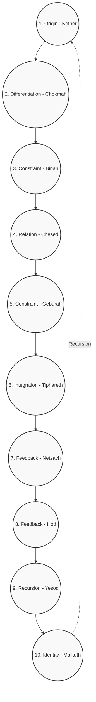

# The Recursive Tree

## Axiomatic Foundation
The Recursive Tree outlines the macro-structure of recursive transformations. While the Recursive Alphabet provides the discrete functional operators (the micro-code), the Recursive Tree represents the sequential, overarching architecture of emergent complexity. It describes how an initial unformed state cascades through a structured hierarchy to achieve complete systemic integration.

"Every recursive system tends toward increasing symbolic complexity."

## The 10 Sephirot = Universal Nodes

The 10 operators correspond to the Kabbalistic Sephirot, acting as generic symbolic states that any tradition can label in its own jargon.

| # | Sephirah (Hebrew) | Kabbalistic Meaning | Recursive-Tree Operator | Core Function (one-sentence) | Cross-Tradition Equivalents |
| :--- | :--- | :--- | :--- | :--- | :--- |
| 1 | Kether (כתר) | The ineffable Crown, Ain Sof – pure, undifferentiated potential. | **O – Origin** | Seed state s₀; the "first spark" before any computation. | Alchemy → Prima Materia; Jung → Self (transcendent); Kashmir → Cit (pure consciousness); Illuminism → True Will (unexpressed); CS → Powered-on, no program; Cybernetics → Full state-space; Quietism → Tao before naming. |
| 2 | Chokmah (חכמה) | Flash of masculine, expansive insight – the first emanation. | **D – Differentiation** (the "what") | A burst of raw energy that splits the unity. | Alchemy → Sulfur (active principle); Jung → Logos; Kashmir → First spanda of light; Illuminism → Divine command; Dynamical-Systems → Perturbation. |
| 3 | Binah (בינה) | Feminine, receptive form-giver – gives shape to Chokmah. | **C – Constraint** (the "how") | Imposes boundaries, turning flash into a definable pattern. | Alchemy → Salt (fixing); Jung → Eros (connecting); Kashmir → Vimarśa (reflection); Illuminism → Intellectual formulation; Dynamical-Systems → Boundary conditions. |
| 4 | Chesed (חסד) | Loving-kindness, unbounded expansion, generosity. | **R – Relation** (expansive) | Adds, connects, proliferates without restriction. | Alchemy → Solve (dissolution); Jung → Great Mother; Kashmir → Icchā Śakti (will to expand); CS → Graph-growth function; Post-Structuralism → Productive desire. |
| 5 | Geburah (גבורה) | Severity, judgment, disciplined limitation. | **C – Constraint** (restrictive) | Subtracts, cuts, sharpens the flow. | Alchemy → Separatio (cutting); Jung → Shadow (critical function); Kashmir → Kriyā Śakti (action-contract); CS → Filter/constraint-solver; Post-Structuralism → Territorialisation. |
| 6 | Tiphareth (תפארת) | Beauty, balance, the heart-center, sacrifice. | **I – Integration** | Synthesises opposite forces into a coherent whole. | Alchemy → Rubedo (red-work); Jung → Ego in balanced relation to Self; Kashmir → Heart-union of Shiva & Shakti; Illuminism → Knowledge + Conversation with HGA; Cybernetics → Homeostasis; Dynamical-Systems → Stable (often strange) attractor. |
| 7 | Netzach (נצח) | Victory, endurance, passion, raw emotional drive. | **Fₑ – Feedback** (emotional/persistent) | Recurs the drive "keep trying until it works." | Alchemy → Volatile fire; Jung → Feeling function; Kashmir → Kriyā Śakti (instinctual); CS → While-loop (conditioned on frustration); Post-Structuralism → Desiring-production (raw). |
| 8 | Hod (הוד) | Splendor, intellect, structured communication. | **Fᵢ – Feedback** (analytical) | Recurs the logical, form-building loop. | Alchemy → Fixed principle; Jung → Thinking function; Kashmir → Jñāna Śakti (knowledge); CS → For-loop/recursion with termination; Post-Structuralism → Machinic assemblage. |
| 9 | Yesod (יסוד) | Foundation – subconscious, imagination, personal pattern-generator. | **R₂ – Recursion** (personal) | Stable self-referential loops that become habit/identity. | Alchemy → Alambic/vessel; Jung → Personal unconscious & ego-complex; Kashmir → Antaḥkaraṇa (mind-instrument); CS → Runtime stack/frame; Cybernetics → Memory & learned routines; Dynamical-Systems → Basins of attraction. |
| 10 | Malkuth (מלכות) | Kingdom – manifest world, reception, "the daughter" of all above. | **I₂ – Identity** (output) | The final, observable state; the "real-world" interface. | Alchemy → Philosopher's Stone (tangible); Jung → Persona & lived life; Kashmir → Tattvas (manifested elements); CS → Program output/UI; Cybernetics → Observable behavior; Quietism → World as-is after ego-cessation. |

## Visual Concept: The Recursive Tree of Life (A Unified Map)

The Recursive Tree can be visualized as a central, glowing tree—the Kabbalistic Tree of Life with its 10 Sephirot and 22 connecting Paths. This structure is multi-layered, allowing different traditions to be overlaid on the same fundamental topology.

### Layer 1 (Core): The Recursive Symbolic Engine (Kabbalah + Recursive Alphabet)
*   The 10 Sephirot are the 10 Recursive Tree Operators (O, D, R, F, I, E, C, T, R, I). They are the primary states/nodes.
*   The 22 Paths are the 22 Hebrew letters, each defined as a 4-aspect Recursive Alphabet Operator (ϕ, ψ, χ, ω). These are the transformational processes/edges.

### Layer 2 (Overlay): The Alchemical Process
*   The Tree is superimposed with the alchemical stages: Nigredo (blackening) on the left pillar (Severity), Albedo (whitening) on the right pillar (Mercy), Rubedo (reddening) in the center (Tiphareth).
*   The paths become the alchemical operations (calcination, dissolution, etc.). Walking the Path from Chesed to Geburah is the alchemical operation of Separation.

### Layer 3 (Overlay): The Jungian Individuation Process
*   The Sephirot are labeled with archetypal stages: The Persona in Malkuth, the Shadow in Yesod, the Anima/Animus in Tiphareth, the Self in Kether.
*   The paths become the processes of integration: The Path from Malkuth to Yesod is "Confronting the Shadow," the Path from Netzach to Hod is "Integrating Logos & Eros."

### Layer 4 (Overlay): The Cybernetic/Computational Model
*   The Sephirot become system states (e.g., Input, Process, Output, Feedback, Memory).
*   The paths become algorithms or data flows.

### Layer 5 (Overlay): The Dynamical Systems View
*   The Sephirot are attractors (stable states).
*   The paths are phase transitions or perturbations that move the system from one attractor basin to another.

## Structural Flow

*The recursive flow cascades from 1 to 10. Upon reaching Identity (Malkuth), the manifested output is fed back as the Origin for a higher-order recursive sequence.*
